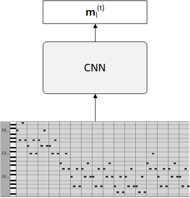
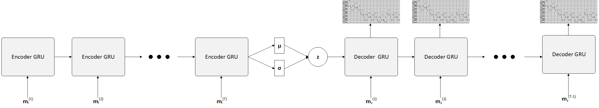

# A CNN-VRNN Model for Polyphonic Music Generation
Stella Koh, Dustin Wright, and Stephanie Chen

We present a recurrent variational autoencoder with convolutional neural network which can be trained to generate musically interesting and diverse polyphonic tunes. The user can 
give an example of a song which has the style or feel of the song they wish to generate, and our model learns to generate variations of that song. Our architecture is inspired by 
the variational autoencoder (VAE) as a stochastic generative model [3,4], as well as recent methods using RNNs in VAEs for language generation [1] and symbolic domain music generation
[2].

## Architecture
Our network consists of a convolutional neural network (CNN) to learn a latent representation of one bar of music, and a variational recurrent autoencoder for generating novel sequences of music.

## Running the code
Our model is implemented in python 2 (2.7). Packages that you should have installed:
- tensorflow >= v1.0.0
- pretty\_midi
- librosa
- numpy 
- matplotlib
- tensorboard
- jupyter

All of the code is in the notebook vae\_cnn\_rnn.ipynb. You can change the training data and model file in the first cell
of the notebook. Simply run all cells sequentially to train on a file and generate samples. Example input files are given under
audio\_files/. Logs are written out to tb/. Output examples when testing are written out to output/test.mid. A tensorboard log from our
final results is packaged with this repo under tb/.

## References
[1] BOWMAN , S., V ILNIS , L., V INYALS , O., D AI , A., J OZEFOWICZ , R., AND B ENGIO , S. Generating Sentences from a Continuous Space. 2016.

[2] FABIUS , O., AND VAN A MERSFOORT , J. R. Variational recurrent auto-encoders. arXiv preprint arXiv:1412.6581 (2014).

[3] FABIUS , O., VAN A MERSFOORT , J. R., AND K INGMA , D. P. Variational recurrent auto-
encoders. CoRR abs/1412.6581 (2014).

[4] KINGMA , D. P., AND W ELLING , M. Auto-encoding variational bayes. CoRR abs/1312.6114
(2013).
